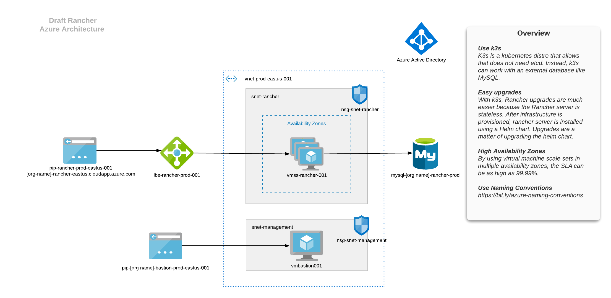

# Rancher 2.4+ with High Availability on Azure
A reference architecture for running Rancher using k3s on Azure with availability zones on Azure.
The goal is to follow best practices for Azure and Rancher. This architecture assumes a [hub/spoke Rancher](https://rancher.com/docs/rancher/v2.x/en/best-practices/deployment-strategies/) topology.



## Pre-Requisites
1. Terraform
2. Azure CLI
3. Helm
4. Kubectl

> :warning: The Terraform state file will be local. Don't commit it to source control.

## Features

- Uses a virtual machine scale - [Here's the differences of a VM scale set vs individual VMs](https://docs.microsoft.com/en-us/azure/virtual-machine-scale-sets/overview#differences-between-virtual-machines-and-scale-sets). Scale set is associated with the load balancer.
- Deploys a sample virtual network - Also deploys two subnets: one for management and one for rancher server.
- Use of Network Security Groups - Attaches network security groups to the subnets. SSH/RDP is only allowed on the management subnet.
- Creates two public IPs - One for the load balancer and one for the bastion box.
- Uses Azure Standard Load Balancer - Standard load balancer can be associated with an availability zone. 
:warning: Standard load balancers are secure by default. Meaning, backend pools will only work if the subnet has an NSG attached.
- Creates a MySQL server - The MySQL server is used by k3s as the control plane storage in lueue of etcd.

## Getting Started

Generate a key pair to provision the virtual machine scale set. 

```bash
$ ssh-keygen \
    -m PEM \
    -t rsa \
    -b 4096 \
    -C "[some email]" \
    -f ~/.ssh/azure-keys/rancher-lab \
    -N [some passphrase]

```

```
$ export TF_VAR_mysql_admin_password="[SOME PASSWORD]"

$ terraform init

$ terraform plan

```

```
$ terrafom apply
```

Download the kubeconfig file to your workstation.
Install Rancher server through Helm

